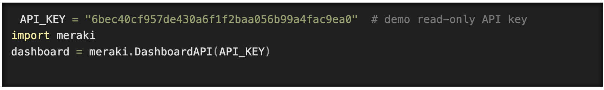
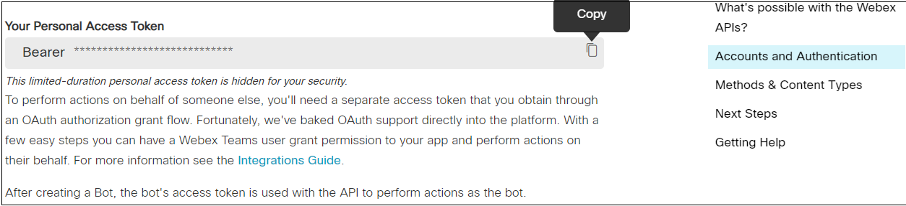
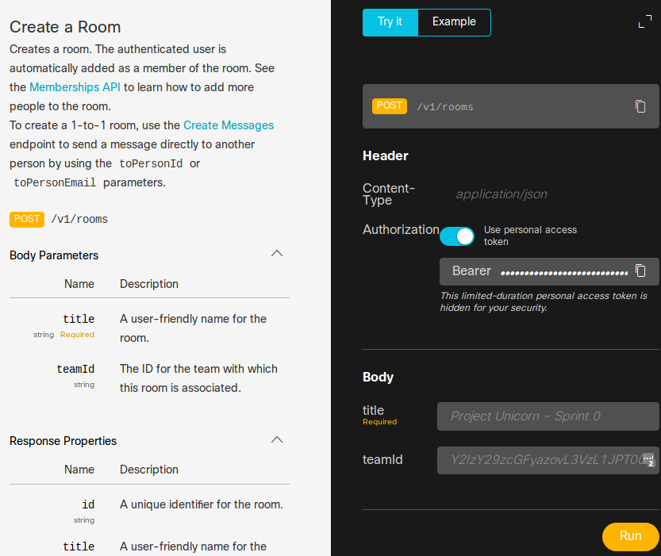
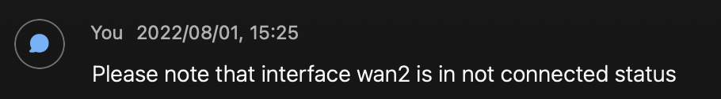

# Meraki Webex Alerts
## Meraki Dashboard API
The Meraki Dashboard API allows developers to handle tedious tasks quickly and simply. The API uses familiar REST conventions over HTTP with JSON data.

What can Dashboard API be used for?
Add new organizations, admins, networks, devices, VLANs, and more
Configure thousands of networks in minutes
On-board and off-board new employees’ teleworker setup automatically
Build your own dashboard for store managers, field techs, or unique use cases

* Remote observance system that starts after a Meraki MT door sensor is opened
* Generate snapshots from the Meraki MV cameras
* Query the latest metrics from the beep base, e.g. temperature, humidity, weight, etc.

### How to initialize the Meraki Dashboard SDK
Import the library and set your API key for authorization

## How to obtain a Meraki API Key

In order to use the Cisco Meraki API, you have to enable the API for your organization first. After having enabled API access, you can generate an API key. You can follow the following instructions on how to enable API access and how to generate an API key:

1. Log in to the Cisco Meraki dashboard

2. In the left-hand menu, go to `Organization > Settings > Dasbhoard API access`

3. Click on `Enable access to the Cisco Meraki Dashboard API`

4. Go to `Profile > API access`

5. Under `API access`, click on `Generate API key`

6. Save the API key in a safe place. Please note that the API key will be shown only once for security purposes. In case you lose the key, then you have to revoke the key and regenerate a new key. Moreover, there is a limit of only two API keys per profile. 

## WebEx API
The Webex APIs give you easy access to the Webex Platform to build Bots, Integrations, or Guest Issuer apps.

### What's possible with the Webex APIs?

The Webex APIs provide your applications with direct access to the Cisco Webex Platform, giving you the ability to:

* Create a Webex space and invite people
* Search for people in your company
* Post messages in a Webex space
* Get Webex space history or be notified in real-time when new messages are posted by others
* Execute a command on a Webex RoomOS device
* and much more!

### How to Access the WebEx API

Navigate to 'Webex for Developers' site in the browser.

Log in using your Webex credentials.
If you don’t have a Webex account, get one by clicking Sign up.

Once logged in, you can get a temporary developer access token for your account by navigating to the Accounts and Authentication section of the Getting Started page.

Copy your developer access token and place it in a safe place, as you are using it in future sections of this Lab:

### WebEx API Call Example: Creating a WebEx room

## Contacts
* Mandla Gqada (mgqada@makwa-it.com)

## Solution Components
* Python 3
* meraki sdk
* requests module
* MultipartEncoder from the requests_toolbelt module
* meraki network
* webex

## Required credentials:
This is the list of the credentials required to run the script. The credentials should not be hardcoded into the script but imported as enviroment variables.

* orgKey = the meraki organization key. For instructions on how to obtain the key, click [here](https://documentation.meraki.com/General_Administration/Other_Topics/Cisco_Meraki_Dashboard_API#:~:text=After%20enabling%20the%20API%2C%20go,API%20key%20on%20your%20profile.)
* orgId = the meraki organization ID. Click [here](https://community.cisco.com/t5/mobility-discussions/how-do-i-find-out-the-organization-id-and-network-id-to-use-for/td-p/3532452) for instructions on how to obtain the organization ID.
* netId = the meraki network ID. Click [here](https://community.cisco.com/t5/mobility-discussions/how-do-i-find-out-the-organization-id-and-network-id-to-use-for/td-p/3532452) for instructions on how to obtain the network ID.
* roomId = the WebEx room ID. Click [here](https://developer.webex.com/docs/api/v1/rooms)
* webexBearer = the WebEx bearer token. Please follow the steps above to retrieve the token.

## Installation/Configuration

The following commands are executed in the terminal.

1. Create and activate a virtual environment for the project:
   
        #WINDOWS:
        $ py -3 -m venv [add_name_of_virtual_environment_here] 
        $ [add_name_of_virtual_environment_here]/Scripts/activate.bat
        #MAC:
        $ python3 -m venv [add_name_of_virtual_environment_here] 
        $ source [add_name_of_virtual_environment_here]/bin/activate
        
> For more information about virtual environments, please click [here](https://docs.python.org/3/tutorial/venv.html)

2. Access the created virtual environment folder

        $ cd [add_name_of_virtual_environment_here]

3. Clone this repository

        $ git clone [add_link_to_repository_here]

4. Access the folder `MerakiWebexAlerts`

        $ cd MerakiWebexAlerts

5. Install the dependencies:

        $ pip install -r requirements.txt

## Execution
1.  Simply run the following command in terminal

    $ python merakiWebexAlert.py

2.  And head over to your webex platform. If any of the uplinks in the meraki platform are down, there will be a new message in the selected meraki room:
    
    

### LICENSE

Provided under Cisco Sample Code License, for details see [LICENSE](license.md)
